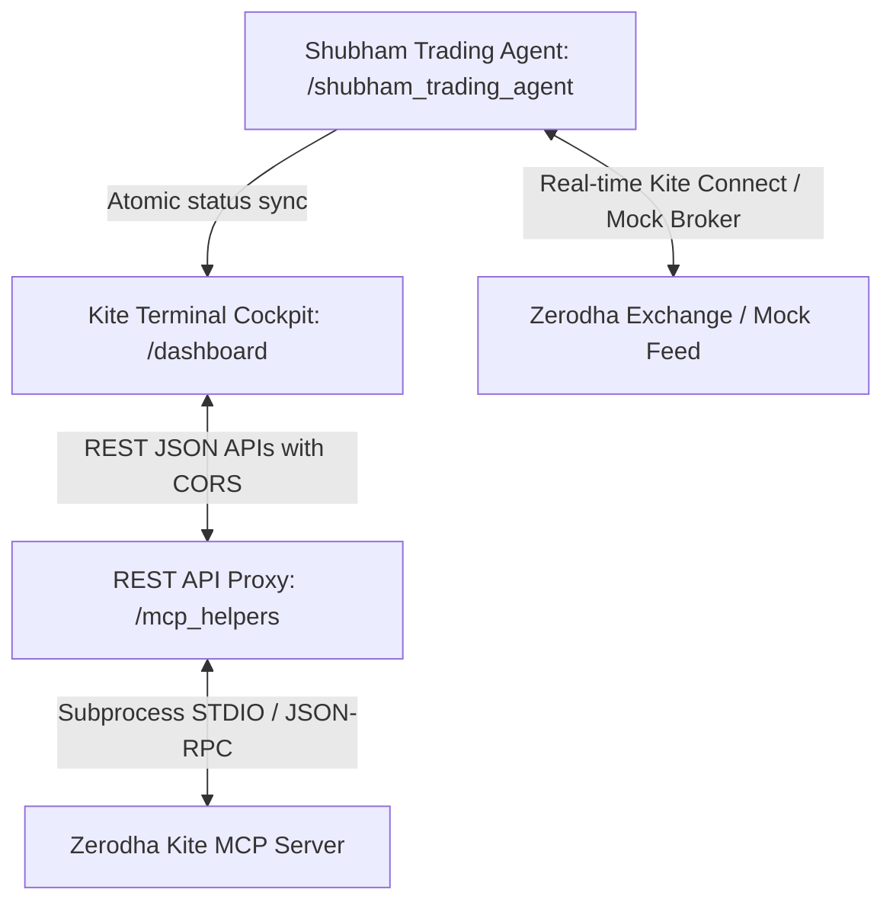

# 🚀 Kite Terminal & Shubham AI Trading Agent

A unified, state-of-the-art, AI-powered algorithmic trading platform and visual cockpit for the Indian stock market (NIFTY 50 Options). 

This platform connects a **cognitive multi-agent Python trading bot** powered by **Google Gemini 3.1 Pro** with a **premium glassmorphic trading dashboard** in the browser, communicating through a lightweight **REST API Proxy**.

---

## 🏗️ System Architecture

The workspace is structured into four modular components designed for high availability, strict separation of duties, and defensive error handling:



### 📁 Directory & Component Map

1. **📁 [shubham_trading_agent/](file:///Users/shubhampathakk/Documents/Assets/Trading/shubham_trading_agent)**:
   * The core algorithmic trading robot in Python 3.13 (using a dedicated `trade_bot` virtual environment).
   * Implements a cooperative **Multi-Agent Specialized Team**:
     * **`Orchestrator`** (`trading_bot.py`): Central brain, event loop, and state machine.
     * **`SignalAgent`** (`agents.py`): Scans charts for technical entries (CPR breakouts, RSI divergence, EMA crosses).
     * **`OrderExecutionAgent`** (`agents.py`): Handles delta-targeted strike selection (ATM weekly options) and slippage limit order retry loops.
     * **`PositionManagementAgent`** (`agents.py`): Monitors live positions tick-by-tick, implements a professional **40/40/20 tiered profit-booking exit plan**, and trails stop-loss via Parabolic SAR.
     * **`LangGraphAgent`** (`langgraph_agent.py`): Google Gemini intelligence director.
     * **`SentimentAgent`** & **`RAGService`**: Scraping financial news for bias filters, and retrieving historical trade logs context.
     * **`test_consensus.py`**: Instantly runs a simulated RBI policy day to dry-run the Gemini debate loops.

2. **📁 [dashboard/](file:///Users/shubhampathakk/Documents/Assets/Trading/dashboard)**:
   * Premium browser-based Single Page Application (SPA) styled with custom modern typography (`Outfit`, `JetBrains Mono`) and glassmorphic zinc dark-mode layouts.
   * Displays real-time portfolio current value, equity available margins, active stock holdings stats tables, and interactive allocation pie charts (Chart.js).
   * Features a **Live AI Agent Monitor Banner** detailing the active bot state, selected strategy, and a button to read the live debate transcripts.
   * Features an **AI Chat Assistant Panel** in the sidebar to converse with the active portfolio in natural language.

3. **📁 [mcp_helpers/](file:///Users/shubhampathakk/Documents/Assets/Trading/mcp_helpers)**:
   * **`mcp_server_proxy.py`**: A zero-dependency Python server that connects to the Kite MCP server, opens local SSE ports, handles Zerodha's dynamic OAuth callbacks, and exposes all tools via REST endpoints with full CORS headers.
   * **`mock_kite.py`**: **The Free Paper-Trading Broker Skill!** A high-fidelity mock client that intercepts `KiteConnect` SDK calls to simulate index data, margins, weekly option chains, and paper orders locally.
   * **`interactive_client.py`** & **`call_tool.py`**: Interactive CLI session helpers.

4. **📁 [kite-mcp-server/](file:///Users/shubhampathakk/Documents/Assets/Trading/kite-mcp-server)**:
   * Cloned official Zerodha Go-based Model Context Protocol server. Used to feed model context via stdio/HTTP/SSE.

5. **📄 [start_terminal.sh](file:///Users/shubhampathakk/Documents/Assets/Trading/start_terminal.sh)**:
   * Executable shell script that runs the REST API Proxy in the background and opens the browser trading cockpit automatically on macOS.

---

## 🧠 Core Intelligence & Smart Data Feeds

### 1. The Gemini 3.1 Pro Consensus Loop
Instead of a single AI decision, `LangGraphAgent` simulates an internal **quantitative board debate** powered by `gemini-3.1-pro-preview`:
* **`Alpha Strategist`** proposes a strategy (focusing on trend momentum, breakouts, and profit capturing).
* **`Risk Manager`** critiques the choice (highlighting whipsaw traps, overextended RSI, or option IV crush on policy events).
* **`Consensus Judge`** reviews RAG historical win rates and FII/DII net flows to make the final, extremely safe strategy selection.

The Orchestrator atomically dumps this debate log to the dashboard folder, allowing you to click **"Read AI Debate Logs"** in your browser and read the exact logic transcripts!

### 2. Free FII & DII Net Daily Flows Scraper
* Automatically scrapes net cash flow of Foreign Institutional Investors (FII) and Domestic Institutional Investors (DII) from the National Stock Exchange of India (NSE).
* Feeds the daily Crore net values directly into Gemini before the open to ensure strategy choices align with institutional money flows.
* Falls back dynamically to a VIX-Aware mathematical model if external networks are down to ensure 100% fail-safe operation.

### 3. 📈 100% Live Real-Time Market Feeds & Execution Toggles
The platform is built on a robust, double-gated connection framework:

#### 🔓 Gate 1: Live API Connection (`MOCK_TRADE` in `.env`)
* **`MOCK_TRADE=false` (Default Active)**: **COMPLETELY disables all mock layers.** The agent loads the official Zerodha `kiteconnect` Python SDK natively, executing all actions directly on Zerodha's official production servers. All index spot levels, options premiums, Greeks, and volumes are 100% live and real-time.
* **`MOCK_TRADE=true`**: A fallback simulated environment using public Yahoo Finance REST feeds (only for offline testing if no Zerodha account exists).

#### 🔒 Gate 2: Capital Risk Safeguard (`paper_trading` in `config.yaml`)
With Gate 1 set to `false` (live Zerodha connection active), you control the capital risk via:
* **`paper_trading: true`**: **Live Real-Data Paper Trading.** The agent processes 100% real-time live exchange ticks to run the strategy debates and trigger signals, but logs orders *simulated* in `/output/trade_log.xlsx` to protect your capital during testing.
* **`paper_trading: false`**: **Live Production Trading.** The agent routes **actual, real-money options orders directly to the National Stock Exchange (NSE) of India using your Zerodha account cash balance!**

---

## 🛡️ Platform Robustness & Indian Derivative Safety Upgrades

To ensure the platform is 100% robust, compliant, and safe to trade live on the National Stock Exchange (NSE) of India, the following institutional-grade safeguards are active:

### 1. 🔐 Self-Restoring Daily Autologin Bypass
*   **The Feature**: Restoring or restarting the bot mid-session no longer prompts you for a manual Zerodha login token.
*   **How it works**: The bot dynamically retrieves your cached daily `ZERODHA_ACCESS_TOKEN` from `.env` on boot, validates it against Zerodha's `profile` API, and automatically restores the session to enter active polling in under 2 seconds. Manual interactive prompts are skipped entirely unless the token is genuinely expired.

### 📊 2. Real-Time "AI Active Trade Monitor" Cockpit Card
*   **The Feature**: When the agent places a trade, an elegant, zinc-glassmorphic **Active Trade Card** slides into view in your browser cockpit automatically.
*   **Real-time P&L Math**: In the background, the orchestrator continuously calculates the option's live premium LTP and your **exact net Rupee (₹) P&L** (including any banked partial exit profits).
*   **Stop Boundaries**: Visualizes your live Hard Stop-Loss (₹), Trailing Stop-Loss (₹), and High Watermark premiums, updating tick-by-tick. Wipes out of view automatically once the position is closed.

### 🛑 3. SEBI Physical Settlement Expiries Gate
*   **The Feature**: Under SEBI regulations, holding In-the-Money (ITM) stock options derivatives during expiry week triggers mandatory physical delivery of shares (requiring over ₹5L–₹20L margin).
*   **How it works**: The bot enforces a strict **DTE < 5 days** exclusion filter. If you attempt to trade a stock option during its monthly expiry week, the bot automatically blocks the trade with a high-priority compliance alarm to protect you from delivery stress and penalties.

### 💸 4. Adaptive Stock Options Liquidity Matrix
*   **The Feature**: Stock options are significantly less liquid than Nifty index options. Rigid thresholds would deadlock the bot or cause high entry/exit slippage.
*   **How it works**: The bot automatically detects the underlying asset type. If a stock option is traded, it dynamically scales down the required Open Interest (OI) gate to $1/10\text{th}$ (minimum 1,000 contracts) and widens bid-ask spread limits up to $5\%$ to align with the natural liquidity profile of Indian stocks.

### 💣 5. Fail-Safe Anti-Orphaning Exit Recovery
*   **State Preservation**: Exit orders (software SL, time cutoff, indicator trigger) must confirm a `COMPLETE` fill status on the exchange before clearing local position state. If the order fails, it retains the local state file (`active_trade.json`) and retries the exit loop in the next tick.
*   **Spread leg Cover**: If exiting a spread and the long leg fills but the short leg fails, the bot dynamically converts the remaining short contract into a simulated **Naked Short option position** in its state files, ensuring subsequent cycles cover it cleanly.

---

## ⚙️ Environment Variables (`shubham_trading_agent/.env`)

Configure your secret keys in the agent's `.env` file:

```env
# Set to false to trade on the live exchange! Set to true for free offline yfinance simulation.
MOCK_TRADE=false

# Zerodha Kite Connect Developer Keys (https://developers.kite.trade/)
ZERODHA_API_KEY=YOUR_ZERODHA_API_KEY
ZERODHA_API_SECRET=YOUR_ZERODHA_API_SECRET
ZERODHA_ACCESS_TOKEN=

# Google Gemini API Key for Strategy Selection & Loss Analysis (https://aistudio.google.com/)
GOOGLE_API_KEY=YOUR_GOOGLE_GEMINI_API_KEY

# News API Key for Real-Time Sentiment Analysis (https://newsapi.org/)
NEWS_API_KEY=YOUR_NEWS_API_KEY
```

---

## 🚀 How to Run the Platform

### 🔑 Setup Your Zerodha App
When registering your application in the **[Zerodha Developer Console](https://developers.kite.trade/)**, configure the following fields:
* **API Type**: Connect (Kite Connect API)
* **Redirect URL**: `http://127.0.0.1:8080/callback`
* **Postback URL**: *(Leave blank)*
* **IP Whitelist**: *(Leave blank)*

---

### 1. Start the Browser Cockpit & Proxy
Open your terminal, navigate to the workspace root, and run:
```bash
./start_terminal.sh
```
*This will run the REST API Proxy in the background on port 5001 and automatically open `dashboard/index.html` in Chrome/Safari.*

### 2. Run the AI Trading Agent
Open a separate terminal, activate your environment, and launch the orchestrator loop:
```bash
cd shubham_trading_agent
source trade_bot/bin/activate
python3 trading_bot.py
```
* **Daily Auth Flow**: On first launch each morning, the terminal will print a Zerodha login link. Click it, authenticate in your browser, and your browser will redirect to `http://127.0.0.1:8080/callback?request_token=XXXXXX`.
* Simply **copy the `request_token` string (after `request_token=`) directly from your browser address bar**, paste it back into the terminal, and hit Enter!
* The bot will automatically generate and cache your daily `access_token` in `.env` so future launches today will boot instantly!

### 3. Dry-Run the Gemini Pro Debate Loop
To instantly test that your Gemini Pro key is active and see a simulated RBI Policy Day debate logs directly in the terminal:
```bash
cd shubham_trading_agent
source trade_bot/bin/activate
python3 test_consensus.py
```
