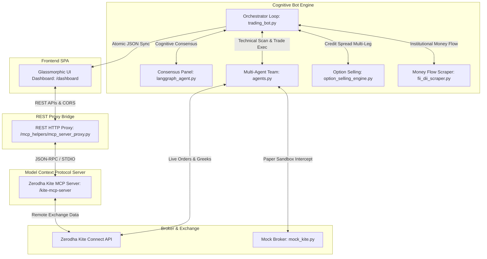
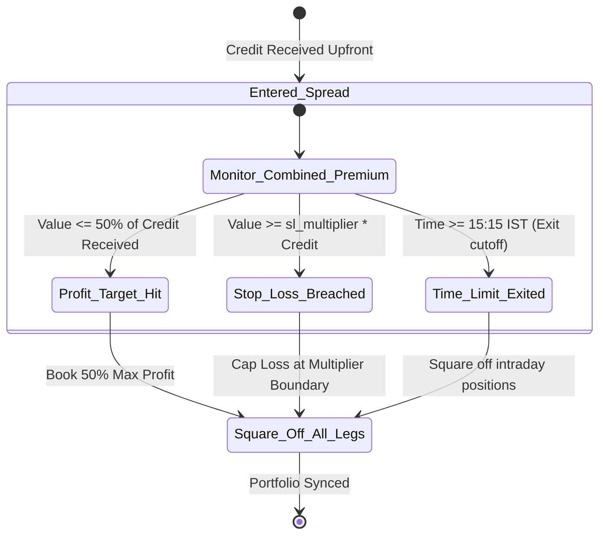

# 🚀 Shubham Trading Agent & Kite Cockpit: Codebase Architecture & Walkthrough

Welcome! This comprehensive architectural walkthrough details the design, modules, data pipelines, and professional safeguards engineered within the **Kite Terminal & Shubham AI Trading Agent** platform.

---

## 🏗️ System Architecture & Modular Design

The workspace is designed under a decoupled, microservices-inspired pattern enforcing a strict separation of concerns. It bridges Python's scientific computing ecosystem, a Go-based Model Context Protocol (MCP) server, and a client-side glassmorphic web interface:



### 📁 Codebase Directory & Component Map

*   **📂 `shubham_trading_agent/`**: The cognitive algorithmic trading robot (Python 3.13 inside the `trade_bot` virtual environment).
    *   [`trading_bot.py`](file:///Users/shubhampathakk/Documents/Assets/Trading/shubham_trading_agent/trading_bot.py): The system orchestrator, event loop, state machine, and rolling operations logger.
    *   [`agents.py`](file:///Users/shubhampathakk/Documents/Assets/Trading/shubham_trading_agent/agents.py): Specialized executors: `SignalAgent` (indicator scanners), `OrderExecutionAgent` (strike selector and slippage limits), and `PositionManagementAgent` (trailing stop-loss and partial exits).
    *   [`langgraph_agent.py`](file:///Users/shubhampathakk/Documents/Assets/Trading/shubham_trading_agent/langgraph_agent.py): AI Strategy consensus debater engine powered by Gemini 3.5 Flash.
    *   [`option_selling_engine.py`](file:///Users/shubhampathakk/Documents/Assets/Trading/shubham_trading_agent/option_selling_engine.py): Institutional-grade credit spread and strangle selling engine.
    *   [`fii_dii_scraper.py`](file:///Users/shubhampathakk/Documents/Assets/Trading/shubham_trading_agent/fii_dii_scraper.py): cash-market money flows scraper from NSE India.
*   **📂 `dashboard/`**: Premium Single Page Application (SPA) styled with outfits typography and zinc-dark glassmorphism.
    *   [`index.html`](file:///Users/shubhampathakk/Documents/Assets/Trading/dashboard/index.html): Structured HTML5 grids for portfolio status, holdings tables, and chat.
    *   [`app.js`](file:///Users/shubhampathakk/Documents/Assets/Trading/dashboard/app.js): Client state manager, REST API fetchers, active position trackers, and Chart.js renderers.
*   **📂 `mcp_helpers/`**: REST Proxy API and Broker Paper-Sandbox layer.
    *   [`mcp_server_proxy.py`](file:///Users/shubhampathakk/Documents/Assets/Trading/mcp_helpers/mcp_server_proxy.py): REST Proxy server bridging the browser CORS requests to Go-based StdIn/StdOut subprocesses.
    *   [`mock_kite.py`](file:///Users/shubhampathakk/Documents/Assets/Trading/mcp_helpers/mock_kite.py): Paper trading simulation intercepting KiteConnect SDK client requests.
*   **📂 `kite-mcp-server/`**: Model Context Protocol server in Go feeding model execution context.

---

## 🧠 The Gemini 3.5 Flash GA Consensus Loop

Rather than using single, rigid rules or unsafe LLM generations, [`langgraph_agent.py`](file:///Users/shubhampathakk/Documents/Assets/Trading/shubham_trading_agent/langgraph_agent.py) spawns a simulated **3-agent Quantitative Investment Board Debate**:

| Agent | Cognitive Persona & Duty | Analytical Filter |
| :--- | :--- | :--- |
| **🟢 Alpha Strategist** | Optimistic momentum bull; focuses on trend breakouts, volume expansions, and capturing premium gains quickly. | CPR Pivot breakouts, EMA crosses, MACD trend flips. |
| **🔴 Risk Manager** | Skeptical bear; guards downside capital, checks RSI extremes, high VIX, theta decay risk, and false stop-loss hunt breakout traps. | ATR Momentum low limits, IV-RV ratios, 15-minute RSI gates. |
| **⚖️ Consensus Judge**| Objective executive; reviews historical RAG strategy win rates, FII/DII Cash Market money flows, and determines the ultimate bulletproof strategy. | RAG recency windows, net crores cash inflows, VIX baseline shifts. |

### 🔄 Deterministic Fallback Cascade

If the Gemini API key is absent, rate-limited, or the network fails, the bot seamlessly cascades through a **5-layer deterministic strategy selector** to ensure 100% runtime uptime:

```
[Layer 1: Event-Day / Expiry-Day Hard Pins]
                   │
       (Bypass if none matches)
                   ▼
[Layer 2: Open-Gap Impulse (>0.8% Gap-and-Go)]
                   │
       (Bypass if none matches)
                   ▼
[Layer 3: Indicator Override Scanners (NR7 / BB Squeeze)]
                   │
       (Bypass if none matches)
                   ▼
[Layer 4: 3D Regime Matrix (VIX x IV x Sentiment Family)]
                   │
       (Bypass if none matches)
                   ▼
[Layer 5: Last-Resort Baseline (Gemini_Default)]
```

---

## ⚙️ double-Gated Safety Connection Framework

To protect trading capital during testing, execution routes pass through a strict, double-gated security checkpoint inside [`trading_bot.py`](file:///Users/shubhampathakk/Documents/Assets/Trading/shubham_trading_agent/trading_bot.py):

```
                  [.env Configuration]
                           │
                           ▼
             [MOCK_TRADE == "true"?]
             ├── YES ──► [Gate 1 Active: Simulated yfinance Offline Mode]
             │
             └── NO ───► [Gate 1 Bypassed: Official Live Zerodha SDK Connected]
                                       │
                                       ▼
                           [config.yaml Settings]
                                       │
                                       ▼
                            [paper_trading == true?]
                            ├── YES ──► [Gate 2 Active: Simulated sandbox orders logged in Excel]
                            │
                            └── NO ───► [Gate 2 Bypassed: LIVE CASH TRADING active on NSE exchange!]
```

> [!IMPORTANT]
> Enabling live cash execution requires setting **both** `MOCK_TRADE=false` in `.env` AND `paper_trading: false` in `config.yaml`. This double-gate structure prevents users from deploying live money by accident.

---

## 🛡️ Derivative safety Gates & Compliance Upgrades

To protect the trader from severe market gaps and regulatory penalties in the Indian derivative market (NSE F&O), several institutional safeguards are implemented:

### 🛑 1. SEBI Physical Settlement Expiry Gate
Under SEBI guidelines, In-the-Money (ITM) stock options held during expiry week are settled via mandatory physical delivery of the actual underlying shares (requiring ₹5 Lakh to ₹20 Lakh of cash margin).
*   **The Safeguard**: [`agents.py:L1079-1087`](file:///Users/shubhampathakk/Documents/Assets/Trading/shubham_trading_agent/agents.py#L1079-L1087) implements a strict check. If the underlying asset is an individual stock option (non-index) and its **Days to Expiry (DTE) is less than 5 days**, the engine blocks all entries and sounds an alarm.

### 📊 2. Adaptive Stock Options Liquidity Matrix
Index options (NIFTY, BANKNIFTY) feature immense liquidity, but individual stock options are extremely thin.
*   **The Safeguard**: [`agents.py:L1011-1022`](file:///Users/shubhampathakk/Documents/Assets/Trading/shubham_trading_agent/agents.py#L1011-L1022) dynamically downscales the required open interest threshold to $1/10\text{th}$ (minimum 1,000 contracts) and widens the acceptable bid-ask spread gate to 5.0% whenever a stock option is selected, ensuring smooth executions with realistic slippage.

### 💥 3. Anti-Orphaning Credit Spread exit Recovery
Multi-leg credit spreads (like Bull Put spreads or Bear Call spreads) must be closed atomically. If the long leg fills but the short leg fails, the trader is exposed to unlimited short option risk.
*   **The Safeguard**: [`agents.py:L1994-2018`](file:///Users/shubhampathakk/Documents/Assets/Trading/shubham_trading_agent/agents.py#L1994-L2018) tracks partial exits on the exchange. If the long leg fills but the short leg fails, the position manager cancels the failed leg, updates `active_trade.json` dynamically to manage the short contract as a naked short, and attempts clean cover/squares-off in the next tick.

### 🚀 4. Threaded WebSocket Tick Cache (0ms Latency Pricing)
*   **The Feature**: Evaluates all pricing gates (trailing stop loss ticks, profit targets, and cutoffs) locally inside RAM rather than requesting LTPs over the web.
*   **How it works**: Spins up Zerodha's `KiteTicker` client on a dedicated background thread. Real-time tick updates are mapped dynamically to a thread-safe `self.tick_cache` in memory. `safe_ltp()` in `infra.py` queries this cache first, eliminating REST latency and API limit blocks entirely.

### ⏱️ 5. Options Buying Capital-Shield Guardrails
*   **Rule 1: 25-Minute \"Dead Trade\" Switch**: Exits any long position held for more than 25 minutes if premium P&L is negative, cutting flat trades early to prevent silent theta decay.
*   **Rule 2: Daily Stop-Loss Circuit Breaker**: Halts all trading for the rest of the session immediately if a trade hits the 25% stop-loss, shielding principal cash from consecutive whipsaw drawdowns.
*   **Rule 3: Morning Volatility Cool-Down Lockout (09:15 - 09:30 AM)**: Restricts evaluations and orders during the opening 15 minutes to let inflated morning IV and stop-loss hunting whipsaws settle down.

---

## 💸 Multi-Leg Option Selling Engine

Managed inside [`option_selling_engine.py`](file:///Users/shubhampathakk/Documents/Assets/Trading/shubham_trading_agent/option_selling_engine.py), the platform supports dynamic multi-leg premium collection (Strangle, Iron Butterfly, Bull Put, and Bear Call spreads):

> [!TIP]
> **Margin Unlocking Execution Sequence**: To prevent high-margin requirement rejections by the exchange, the Option Selling Engine always buys the cheap protection legs first (`ce_hedge_symbol` and `pe_hedge_symbol`), unlocks Zerodha's margin-benefit, and only then sells the credit premium legs.

### 📈 Dynamic Risk & Profit Monitors


---

## 🖥️ Browser Cockpit REST Proxy Bridge

Because modern browsers block direct network sockets or StdIn/StdOut pipes due to CORS/security, [`mcp_helpers/mcp_server_proxy.py`](file:///Users/shubhampathakk/Documents/Assets/Trading/mcp_helpers/mcp_server_proxy.py) runs a lightweight, zero-dependency REST proxy server on port `5001` that:

1.  **Spawns the Go-based Kite MCP Server** as a subprocess.
2.  **Performs the JSON-RPC initialization handshake** over standard I/O.
3.  **Exposes local REST routes** allowing the glassmorphic dashboard to fetch client metrics:
    *   `GET /status`: Checks health.
    *   `GET /profile`: Resolves user session info.
    *   `GET /margins`: Fetches available margins.
    *   `GET /holdings`: Fetches active equity investments.
    *   `GET /bot_status`: Serves the real-time state of the Python bot (P&L, debate logs, active trailing SL trigger).
    *   `POST /call`: Accepts general JSON-RPC payloads and redirects them to remote Zerodha tools.

---

## 📊 Live Cockpit Web Interface

Designed inside [`dashboard/index.html`](file:///Users/shubhampathakk/Documents/Assets/Trading/dashboard/index.html) and [`dashboard/app.js`](file:///Users/shubhampathakk/Documents/Assets/Trading/dashboard/app.js), the frontend displays:

*   **Zinc Glassmorphic Cards**: Premium glassmorphism visuals containing total portfolio value, day P&L values, and available balances.
*   **AI Agent Status Bar**: Highlights the active bot status (AWAITING_SIGNAL, IN_POSITION, SETUP, or STOPPED) alongside the active strategy name, daily sentiment bias, and a button to read the live Gemini quant debate transcripts inside a modern modal dialog.
*   **Live Active Option Card**: Shows the live contract code, quantity, entry price, current premium, exact net Rupee P&L, and ticks trailing stop levels and high watermarks.
*   **Live Operations Feed Console**: Displays real-time scrolling timestamped operational logs color-coded dynamically in the sidebar console box.
*   **AI Chat Assistant Sidebar**: Converse with your portfolio using natural language (analyzes holdings, yields, margins, and calculates top/worst performers).
