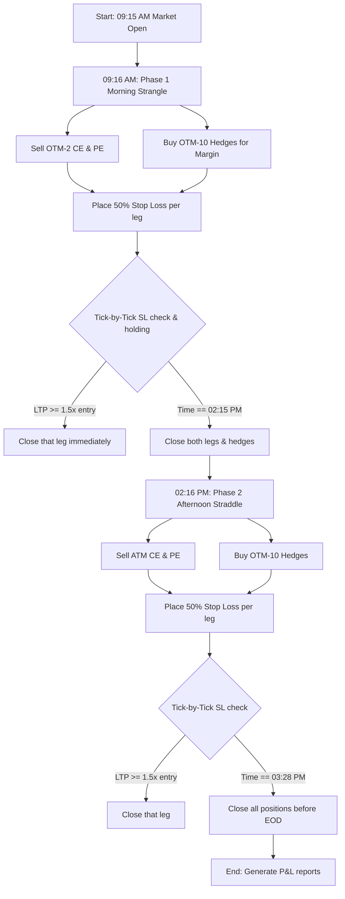

# 📈 Sumeet Mongia's Intraday Option Selling Strategy Guide

Welcome to the premium **Option Selling Masterclass Integration**!

This algorithmic implementation of the YouTube Option Selling Strategy course translates Sumeet Mongia's rule-based double-short strangle/straddle approach into a high-frequency automated execution module natively inside your AI trading bot.

---

## 🏗️ Strategy Rules & Parameters

The strategy runs **100% intraday** on **NIFTY 50** options (designed to run on Monday, Tuesday, and Friday for maximum theta decay, but is fully available any day of the week).



### 1. Phase 1: Morning Strangle (09:16 AM – 02:15 PM)
*   **Execution time**: **09:16 AM** (immediately after market open volatility settles).
*   **Short Strikes**: Out-of-the-money **2 strikes away** (ATM ± 100 points).
    *   *Call Strike*: ATM + 100 (OTM-2)
    *   *Put Strike*: ATM - 100 (OTM-2)
*   **Hedge Strikes (Margin Benefit)**: Out-of-the-money **10 strikes away** (ATM ± 500 points, trades at ~₹1 - ₹2).
    *   *Call Hedge*: ATM + 500 (OTM-10)
    *   *Put Hedge*: ATM - 500 (OTM-10)
*   **Stop Loss**: **50% individually placed on each short leg**. If premium rises by 50%, buy back that leg immediately and keep the other leg running.
*   **Exit Cutoff**: **02:15 PM** (exit both short legs and hedges completely).

### 2. Phase 2: Afternoon Straddle (02:16 PM – 03:28 PM)
*   **Execution time**: **02:16 PM** (immediately after morning phase exits).
*   **Short Strikes**: At-the-money **0 strikes away** (ATM).
    *   *Call Strike*: ATM
    *   *Put Strike*: ATM
*   **Stop Loss**: **50% individually placed on each short leg**.
*   **Exit Cutoff**: **03:28 PM** (completely close both legs and hedges before market close).

### 3. Risk Management Safeguards
*   **High VIX / Event Days**: The strategy automatically checks VIX levels. During extremely high volatility or scheduled market-moving events, the bot bypasses entries to protect capital from sharp swings hitting both stops.

---

## 🛠️ File Architecture & Diffs

The option selling architecture has been implemented in a highly decoupled, modular way to guarantee **zero regression risk** to your existing options buying code:

1.  **📁 [option_selling_engine.py](file:///Users/shubhampathakk/Documents/Assets/Trading/shubham_trading_agent/option_selling_engine.py)** *(NEW)*:
    *   Houses the `OptionSellingEngine` state machine.
    *   Manages multi-leg strangle/straddle execution.
    *   Handles margin hedges, individual 50% tick-by-tick SL monitors, and the morning/afternoon transition times.
    *   Maintains state persistently in `/state/active_strangle.json`.
2.  **📁 [strategy_factory.py](file:///Users/shubhampathakk/Documents/Assets/Trading/shubham_trading_agent/strategy_factory.py)**:
    *   Added and registered `IntradayOptionSellingStrategy` in the factory dictionary.
3.  **📁 [trading_bot.py](file:///Users/shubhampathakk/Documents/Assets/Trading/shubham_trading_agent/trading_bot.py)**:
    *   Imported and initialized `OptionSellingEngine`.
    *   Injected a clean, isolated loop branch at the start of the event loop: if the active strategy is `Intraday_Option_Selling`, the loop completely bypasses buying gates and delegates 100% of execution to the new high-frequency option selling engine.
4.  **📁 [langgraph_agent.py](file:///Users/shubhampathakk/Documents/Assets/Trading/shubham_trading_agent/langgraph_agent.py)**:
    *   Registered `"Intraday_Option_Selling"` as a valid strategy in the quantitative consensus selector.

---

## 🚀 How to Activate & Run

To run this strategy on your live account or in sandbox paper trading mode:

### Step 1: Configure `config.yaml`
Set `Intraday_Option_Selling` as the active strategy in the deterministic selector overrides, or pin it in the user prompt, or simply set the default startup strategy.
For example, you can set:
```yaml
strategy_selector:
  use_llm: false # to force the deterministic default
```
And in `trading_flags` (or simply override at startup):
```yaml
# For Sandbox testing (Recommended first)
trading_flags:
  paper_trading: true
```

### Step 2: Run the Bot
Navigate to the folder and execute the bot:
```bash
cd shubham_trading_agent
source trade_bot/bin/activate
python3 trading_bot.py
```

When the bot boots, you will see a gorgeous setup confirmation banner detailing the active strangle and its stop levels!

> [!TIP]
> Sells require higher margins than buys, but the built-in deep OTM hedges will automatically reduce the margin required on your Zerodha Kite account by up to **70%**! Ensure your account has multi-leg NFO permissions enabled.
